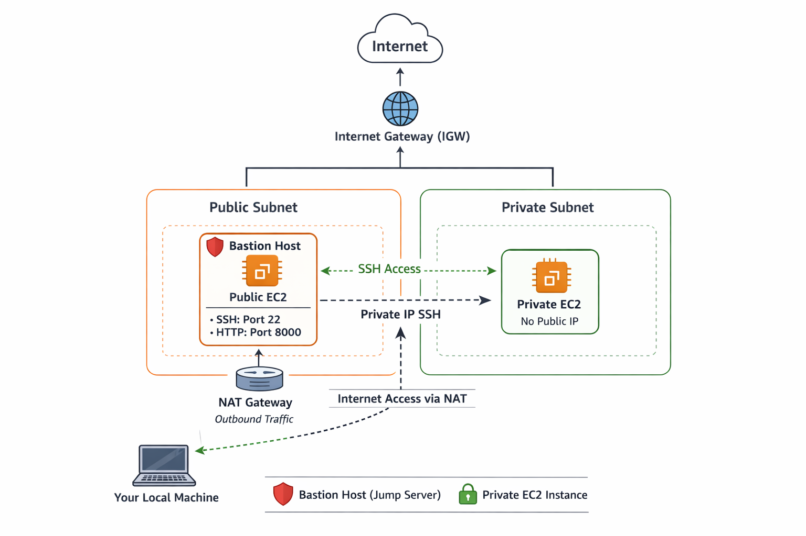

# AWS Cloud Infrastructure (VPC + EC2) mini project
## Project Overview

This mini-project demonstrates the <b>foundation of AWS cloud infrastructure</b> for secure compute deployment. The goal was to build a <b>VPC-based architecture</b> with <b>public and private subnets</b>, a <b>NAT gateway</b>, and a <b>bastion host (public EC2)</b> to securely access private resources.

This project focuses on:

- Understanding <b>VPC fundamentals</b>
- Deploying EC2 instances in both public and private subnets
- Setting up a <b> bastion host</b> for secure SSH access
- Validating internet connectivity for private instances via NAT
- Demonstrating Terraform-based <b> IaC</b> provisioning

## Architecture

#### Key Points:
1. <b>Public Subnet (Bastion Host):</b>
    - Directly connected to IGW
    - Has a public IP
    - Security group allows SSH from your IP and FastAPI port (8000)
    - Acts as the jump host to reach private instances
2. <b>Private Subnet:</b>
    - No public IP
    - Can reach internet only via NAT gateway
    - Not directly accessible from the internet
3. <b> NAT Gateway:</b>
    - Placed in the public subnet
    - Allows private instances to send outbound traffic to the internet
    - Prevents inbound connections from the internet

## Components Deployed
1. VPC
    - CIDR: `10.0.0.0/16`
    - Two subnets:
        - Public: `10.0.1.0/24` (with `map_public_ip_on_launch = true`)
        - Private: `10.0.2.0/24`
    - Internet Gateway attached
    - Route tables configured:
        - Public subnet → IGW
        - Private subnet → NAT Gateway

2. Security Groups
    - Bastion Host SG:
        - SSH (22) → your IP
        - TCP (8000) → anywhere
    - Private Instance SG:
        - Allow all traffic from Bastion SG
        - Outbound allowed to `0.0.0.0/0` via NAT

3. EC2 Instances
    - Public EC2 (Bastion Host)
        - `t2.micro`, Amazon Linux 2
        - Public IP assigned
        - Used as a jump server
    - Private EC2
        - `t2.micro`, Amazon Linux 2
        - No public IP
        - Accessed only via Bastion host
        - Can reach the internet via NAT
4. NAT Gateway
    - Allocated Elastic IP
    - Provides outbound internet access for private instances

## Bastion Host Workflow

The bastion host is central to this architecture:
1. Why we need it:

    Private EC2s have no public IP, so SSH access from the internet is impossible.

2. How it works:
    - Bastion host is in the public subnet, accessible from your local machine via SSH.
    - You SSH into the bastion:
    ```sh
        ssh -i lab_test_key.pem ec2-user@<bastion-public-ip>
    ```
    - From the bastion, you SSH into private instances using their private IPs:
    ```sh
        ssh ec2-user@10.0.2.10
    ```
3. Security Benefits:
    - Reduces attack surface (only one public-facing instance)
    - Private instances remain isolated from the internet
    - All traffic to private instances goes through bastion for auditing/logging
4. Additional Usage:
    - Docker containers can be deployed on bastion for small testing purposes
    - The bastion can forward ports for private instances if needed

## Step-by-Step Deployment
1. Terraform
    - Create variables for VPC CIDR, subnets, and key name
    - Define `main.tf` with:
        - VPC
        - Public & Private subnets
        - IGW
        - NAT Gateway
        - Route Tables
        - Security Groups
        - EC2 instances (bastion + private)
    - Run:
        ```sh
            terraform init
            terraform plan
            terraform apply
        ```
2. Bastion Host
    - SSH into bastion:
    ```sh
        ssh -i lab_test_key.pem ec2-user@<public-ip>
    ```
    - From bastion, SSH into private EC2:
    ```sh
        ssh ec2-user@<private-ip>
    ```
    - Install Docker & run containers:
    ```sh
        sudo yum update -y
        sudo yum install docker -y
        sudo service docker start
        docker pull your-fastapi-image
        docker run -d -p 8000:8000 your-fastapi-image
    ```

## Lessons Learned

1. Public vs Private Subnet distinction

2. NAT Gateway for outbound internet access

3. Bastion host workflow for secure SSH

4. Security groups vs network ACLs

5. Terraform as IaC for reproducible cloud infrastructure

6. EC2 key pairs for secure SSH access

## Optional Enhancements
- Add Application Load Balancer for private EC2s

- Use Terraform modules for reusable architecture

- Enable multi-AZ for high availability